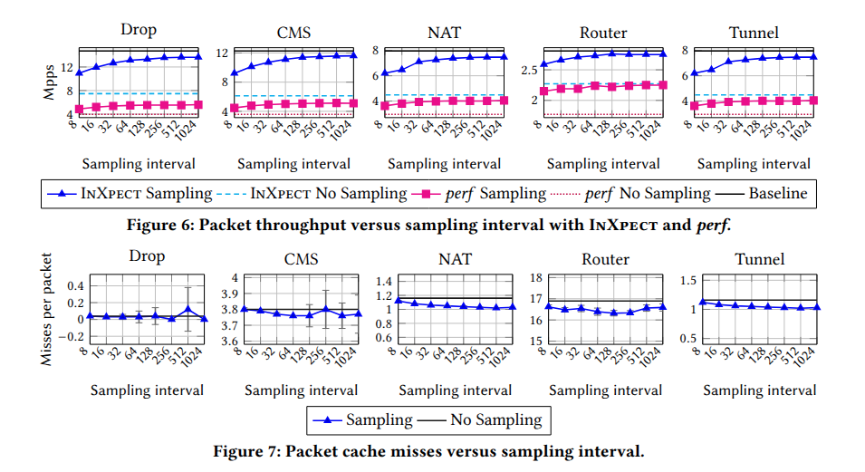

# Inxpect: Lightweight XDP Profiling

InXpect is a lightweight system for profiling XDP applications that minimizes profiling over-head and provides the flexibility needed to enable advanced profiling, such as fine-grained code block analysis.

## Design

Inxpect is composed by two main part: the userspace tool and a set of command kernel side necessary to identify the code's sections to be monitored. 

## Kernel side commands

A simple set of macro are defined for helping the user to define the sections of the code to be monitored...

We provide two different way to collect data, the first one called `MULTIPLEXED` allows to collect data about different events in the same section, doing round-robin sampling of the events. The second one called `ARRAY` allows to collect data about a single event in a section, but has a lower overhead userspace side, allowing faster access to the data.

Then is also possible to collect data from all processed packets or doing sampling. The sampling is done kernel side in the XDP program and despite we provide a set of predefined commands, the user easly can define their own sampling condition or make any other modification to the code.

## Userspace tool

The userspace tool is a command line application that allows the user to collect the profiling data from the kernel and to print it in a human readable format. The tool is designed to be easy to use and to provide a simple interface for collecting and analyzing profiling data. 

<center>

</center>

When an XDP program is loaded with the Inxpect macros, initially each sections is disable and do not collect any data. Inxpect enables the sections at runtime, allowing the user to enable and disable them as needed. This allows for fine-grained control over the profiling process and minimizes the overhead of profiling.


## Experiments

The experiments conducted with Inxpect show that it is able to provide accurate profiling data with minimal overhead. The tool has been tested on a variety of XDP applications, you can find them in the [experiments](/inxpect/experiments) folder.

<center>

</center>


# Installation

After cloning the repository, you have to compile and load the kernel module and the userspace tool. 

```bash
cd inxpect/kperf_
make
make load
```

Then you can compile the userspace tool:

```bash
cd .. # inside inxpect directory
make
```

Then be sure to read and fully understand the [SETTINGS.md](SETTINGS.md) file, where you can find the instructions to set the right PMC register for your system and how to configure the tool.

If you want to check our experiments, you can compile the XDP programs in the `inxpect/experiments` folder:

```bash
cd inxpect/experiments
make
```

You will find two versions in addition to base version: 
- `kfunc`: uses the set of macros to collect data from the kernel functions, it measures every execution of the program. 
- `sr`: as in the previous one, but it uses the sampling mechanism to collect data when a sampling condition is true. By default the sampling condition is set to collect data every `2^n` packets, where `n` is set by the user at runtime.

# Usage

Once your setup is ready, the next step is to run the profiling tool.

```bash
# i.e profile drop program measuring the number of instructions and cycles every 8 packets for 10 seconds
sudo ./inxpect -n drop -e instructions,cycles -s 3 -t 10
```

# Others

## Bugs

If Inxpect does not disable the event counter at the end of the program. It is possible to reset the event counters by using the `clean_reg.sh` script, but you must be sure to set the right PMC register in the file before running it, based on your processor architecture. 

> [!CAUTION]
> This command will reset the event counter and the PMC registers. This will disable the monitoring of the events. Be sure to set the right PMC register in the file.
```bash
sudo ./clean_reg.sh -1
```
